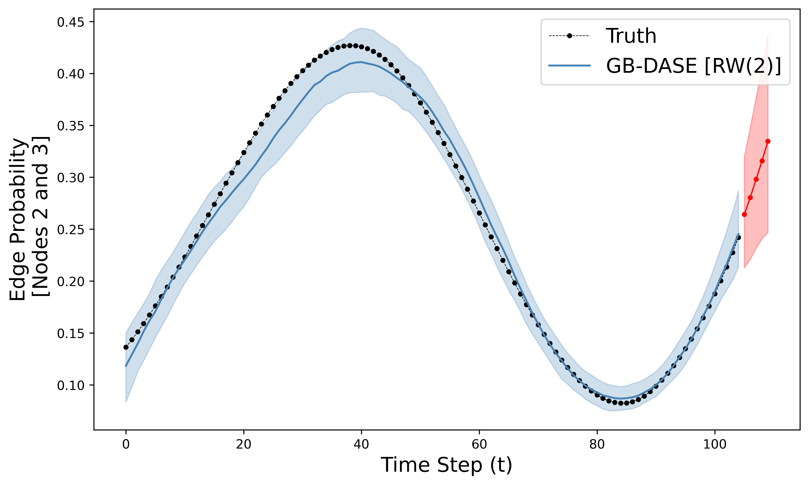

[](https://github.com/joshloyal/multidynet/blob/master/LICENSE)

## Generalized Bayes for Dynamic Random Dot Product Graphs 

*Author: [Joshua D. Loyal](https://joshloyal.github.io/)*

This package provides an interface for the model described in
"Generalized Bayesian Inference for Dynamic Random Dot Product Graphs." Inference is performed using
an efficient Gibbs sampler. For more details, see [Loyal (2024)](https://arxiv.org/abs/2401.09715).

Dependencies
------------
``dynrdpg`` requires:

- Python (>= 3.10)

and the requirements highlighted in [requirements.txt](requirements.txt). To install the requirements, run

```python
pip install -r requirements.txt
```

Installation
------------
Use the following commands to get the copy from GitHub and install all the dependencies:

```
>>> git clone https://github.com/joshloyal/dynrdpg.git
>>> cd dynrdpg
>>> pip install -r requirements.txt
>>> python setup.py install
```

Example
-------

```python
import matplotlib.pyplot as plt
import numpy as np

from dynrdpg import DynamicRDPG
from dynrdpg.datasets import simulate_network_bspline

k_steps = 5

# load synthetic network
Y, X_true, probas_true = simulate_network_bspline(
        n_nodes=200, n_time_steps=100, density=0.2,
        k_steps=k_steps, random_state=123)


# 105 networks (100 in-sample, 5 forecasting) with 200 nodes each
# the adjacency matrices are stored as numpy arrays
# of shape (n_time_steps, n_nodes, n_nodes)
Y.shape
#>>> (105, 200, 200)

# initialize a GB-DASE [RW(2)] model with d = 2 embedding dimensions
rdpg = DynamicRDPG(n_features=2, rw_order=2, random_state=42)

# run the MCMC algorithm for 250 burn-in iterations and collect 500 post burn-in samples
# XXX: In practice the number of burn-in and post burn in samples should be larger
rdpg.sample(Y[:-k_step], n_burnin=250, n_samples=500)

#>>> 100%|███████████████████████████████████████████████████████████████████████████| 750/750 [07:00<00:00,  1.78it/s]

# compute the sampled in-sample edge probabilities 
probas_pred = rdpg.predict()

probas_pred.shape
#>>> (500, 100, 200, 200)  

# compute k-step ahead forecasts (here k = 5)
probas_forecast = rdpg.forecast(k_steps=5, return_subdiag=False)

probas_forecast.shape
#>>> (500, 5, 200, 200)

# plot the in-sample and forecast edge probability between node 2 and node 3
# with 95% point-wise credible bands
i, j = 1, 2
n_time_steps, n_nodes, _ = Y[:-k_step].shape

fig, ax = plt.subplots(figsize=(10, 6))

# plot true probabilities
ax.plot(probas_true[:, i, j], 'k.--', lw=0.5, label='Truth')

# plot in-sample predictions with 95% pointwise credible intervals
cis = np.quantile(probas_pred[:, :, i, j], q=[0.025, 0.5, 0.975], axis=0)
ax.plot(np.arange(n_time_steps), cis[1], color='steelblue', label="GB-DASE [RW(2)]")
ax.fill_between(np.arange(n_time_steps), cis[0], cis[2], color='steelblue', alpha=0.25)

# plot forecasts with 95% pointwise credible intervals
cis = np.quantile(probas_forecast[:, :, i, j], q=[0.025, 0.5, 0.975], axis=0)
ts = np.arange(n_time_steps, n_time_steps + k_steps)
ax.plot(ts, cis[1], '.-', color='red', lw=1)
ax.fill_between(ts, cis[0], cis[2], color='red', alpha=0.25)

ax.legend(fontsize=16)
ax.set_xlabel('Time Step (t)', fontsize=16)
ax.set_ylabel('Edge Probability\n [Nodes 2 and 3]', fontsize=16)

plt.show()
```




Simulation Studies and Real-Data Applications
---------------------------------------------

The [scripts](scripts) directory includes the simulation studies and real-data application found in the article.
